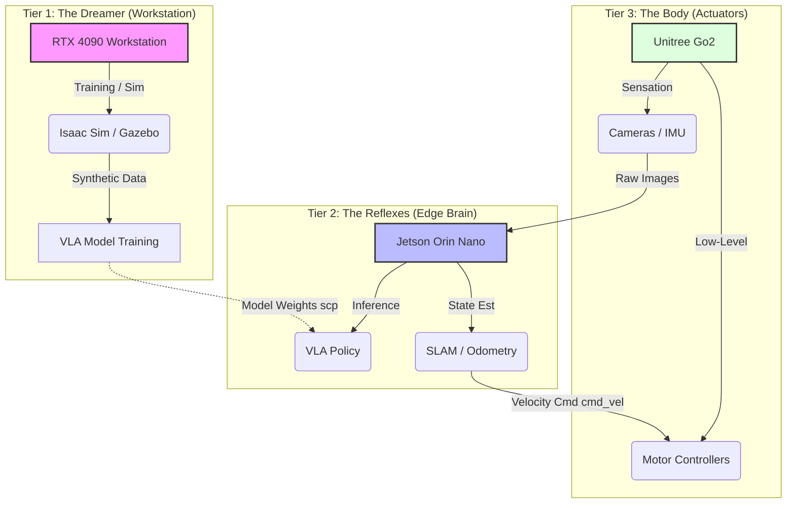

# The 3-Tier Architecture

You cannot fit a data center inside a humanoid robot. It would be too heavy to walk, and the batteries would drain in 3 minutes.
Conversely, you cannot run a robot entirely from the cloud. The speed of light (and Wi-Fi latency) is too slow to keep it from falling over.

So, we split the brain. This is the **Tri-Partite Nervous System** of Physical AI.

## Tier 1: The Dreamer (The Workstation)

*   **Role:** Infinite Compute, Offline Training, Simulation.
*   **Hardware:** NVIDIA RTX 4070 Ti / 4090, i9 CPU, 64GB RAM.
*   **Analogy:** The **Subconscious Mind** (Dreaming).

Think of an athlete visualizing a race before running it. They run the scenario in their head a thousand times, imagining every obstacle. That is what your Workstation does.

In **Isaac Sim**, we run thousands of parallel simulations. We make the robot walk on virtual ice, gravel, and lava. We push it over. We blindfold it. We do this because **failure in simulation is free**, but failure in reality costs $10,000.

**Why we need it:**
-   **Safety:** You can't train Reinforcement Learning (RL) on a real robot. It needs millions of falls to learn to walk. A real robot would break after 5 falls.
-   **Speed:** We can simulate 100 days of experience in 1 hour using parallel GPU physics.

## Tier 2: The Reflexes (The Edge Brain)

*   **Role:** Real-time Inference, Perception, Planning.
*   **Hardware:** NVIDIA Jetson Orin Nano / AGX Orin.
*   **Analogy:** The **Conscious Mind** (Cerebellum & Visual Cortex).

This is the computer physically bolted to the robot's chest. It has a strict "Power Budget"—usually between 15W and 60W.

Its job is **Inference**. It takes the "wisdom" (Neural Network weights) learned by the Dreamer and applies it to the "now."
It processes the massive stream of data from the eyes (cameras) and ears (Lidar) to answer three questions:
1.  **Localization**: "Where am I?" (SLAM)
2.  **Perception**: "What is that?" (Object Detection)
3.  **Planning**: "How do I get there?" (Nav2)

**The Constraint:** It *must* make decisions at **30 Hz** (33 milliseconds per frame). If it lags, the robot moves blind.

## Tier 3: The Body (The Actuators)

*   **Role:** Physics Interaction, Proprioception.
*   **Hardware:** Microcontrollers (STM32), Motor Drivers, IMUs.
*   **Analogy:** The **Spinal Cord**.

This is the "Reptilian Brain." It doesn't know what a "door" is. It doesn't know what "human" is. It only knows: *"Keep this motor at 45 degrees."*

It runs tight **PID (Proportional-Integral-Derivative)** control loops at **1000 Hz** (1 millisecond). It listens to the Inner Ear (IMU) to keep the robot balanced against gravity.

:::warning The Hierarchy of Latency
To be a roboticist, you must respect the clock.

| Tier | Component | Target Frequency | Time Budget | Consequence of Lag |
| :--- | :--- | :--- | :--- | :--- |
| **1** | Training (Workstation) | N/A (Offline) | Hours/Days | Slow research progress. |
| **2** | Vision/Planning (Jetson) | 30 Hz | 33 ms | Robot hesitates, misses dynamic obstacles. |
| **3** | Motor Control (MCU) | 1000 Hz | 1 ms | **Catastrophic failure.** Robot falls instantly. |
:::

## Why This Architecture?

Students often ask: *"Professor, why can't I just stream the video to my 4090, process it there, and send commands back? Why buy a Jetson?"*

**The answer is the "Network Hop".**

Wi-Fi is unreliable. Packet loss happens. Jitter happens.
If your robot relies on Wi-Fi to balance (Tier 3), and someone turns on a microwave nearby, your robot falls.
If your robot relies on Wi-Fi to see (Tier 2), and the connection drops for 500ms, it walks into a wall.

**Rule of Thumb:**
-   **Reflexes (Balance/Obstacle Avoidance)** MUST be local.
-   **High-Level Thought (Chat/Complex Reasoning)** CAN be remote.
