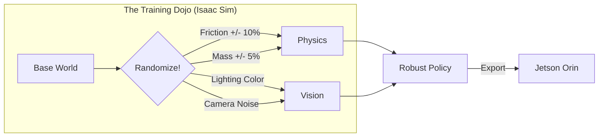

# The Sim-to-Real Workflow

In software, "Production" is just a server with more RAM.
In robotics, "Reality" is a hostile environment that hates your code.

The central challenge of Physical AI is the **Reality Gap**: the discrepancy between how physics works in your simulator and how it works in the universe.

## The Gap: Why Robots Fail
In **Isaac Sim** (Tier 1):
-   Friction is a perfect float (`0.8`).
-   Floors are perfectly flat planes.
-   Sensors return perfect pixel values.
-   Joints have zero play.

In **Reality** (Tier 3):
-   Friction varies because of dust on the floor.
-   Floors have microscopic bumps that trip bipedal robots.
-   Cameras have motion blur, lens flare, and ISO noise.
-   Gearboxes have "backlash" (wiggle room).

If you train a robot in a perfect world, it becomes "overfit" to perfection. When you put it on the ground, it shakes, stutters, and falls.

## The Bridge: Domain Randomization

We don't fix the gap by making the simulator perfect (that's impossible).
We fix it by making the simulator **chaotic**.

We use a technique called **Domain Randomization**. We train the AI not on *one* floor, but on *thousands* of slightly different floors.

### What We Randomize
1.  **Visuals**: We change the color of the floor, the position of the sun, and the texture of the walls. This forces the Vision model to ignore "distractors" and focus on geometry.
2.  **Dynamics**: We jitter the mass of the robot links. Maybe the arm is 1.1kg today, maybe 0.9kg. This forces the PID controllers to be robust.
3.  **Latency**: We artificially delay sensor packets in simulation. If the robot can handle 20ms lag in sim, it can handle Wi-Fi jitter in reality.

## The Workflow: From Dream to Reflex

1.  **Generate Data**: Run Isaac Sim on the Workstation. Collect 10,000 episodes of the robot trying to pick up a cup.
2.  **Train**: Update the Neural Network weights using Reinforcement Learning (RL).
3.  **Validate**: Run the policy in a "Held Out" simulation environment (one with friction values the robot hasn't seen).
4.  **Compile**: Convert the PyTorch model to **TensorRT** (optimized for Jetson).
5.  **Deploy**: SSH the `.engine` file to the Jetson Orin.
6.  **Pray & Test**: Enable the motors. Keep your hand on the Emergency Stop.

:::tip Anticipatory Guidance
You will be tempted to skip the "Domain Randomization" step because it makes training slower. **Don't.**
A robot trained without randomization is a "fair-weather pilot." It works fine until a cloud moves over the sun, the lighting changes, and your robot suddenly thinks the floor is a hole.
:::
