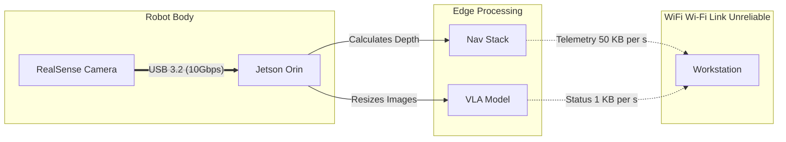

# Data Flow & The Bandwidth Bottleneck

You might ask: "Professor, why do I need a $500 Jetson? Can't I just stream the camera feed to my $4000 Workstation and do the heavy lifting there?"

This is the most common mistake junior roboticists make. They underestimate **Data Gravity**.

## The Firehose Math

Let's do the math for a typical humanoid sensor stack.
We are using the **Intel RealSense D435i**.

### RGB Stream
-   Resolution: 1920 x 1080 (1080p)
-   Channels: 3 (Red, Green, Blue)
-   Bytes per pixel: 1 byte (8-bit)
-   FPS: 30
-   **Bandwidth**: $1920 \times 1080 \times 3 \times 30 \approx 186,624,000$ bytes/sec ($\approx 178$ MB/s).

### Depth Stream
-   Resolution: 1280 x 720
-   Channels: 2 (16-bit depth integer)
-   FPS: 30
-   **Bandwidth**: $1280 \times 720 \times 2 \times 30 \approx 55,296,000$ bytes/sec ($\approx 53$ MB/s).

**Total per Camera**: $\approx 231$ MB/s.
**Total for Humanoid (3 Cameras)**: $\approx 693$ MB/s.

### The Wi-Fi Reality Check
A really good Wi-Fi 6 connection *might* sustain 50-80 MB/s in a noisy lab environment.
**You are trying to push 700 MB/s through a 50 MB/s pipe.**

Result?
1.  **Latency Spikes**: Packets buffer, creating seconds of lag.
2.  **Frame Drop**: The robot misses visual cues.
3.  **Disconnects**: The router gives up.

## The Solution: Edge Compute

We follow the Golden Rule of Robotics: **Process heavy data where it is born.**

The **Jetson Orin** connects directly to the cameras via **USB 3.2** (10 Gbps bandwidth). It drinks from the firehose without spilling a drop.

We only send **Telemetry** over Wi-Fi:
-   "I am at location X, Y." (Bytes)
-   "I see a cup." (String)
-   "Battery is at 80%." (Float)

We keep the heavy video on the Jetson.

:::danger The "Remote Desktop" Trap
Students often try to run VNC or TeamViewer on the Jetson to "see what the robot sees."
**This eats your bandwidth.**
If you need to debug video, use ROS 2 image transport with compression (`ros2 run image_transport republish compressed`), or record a "rosbag" to disk and analyze it later. Do not stream raw video while the robot is balancing!
:::
